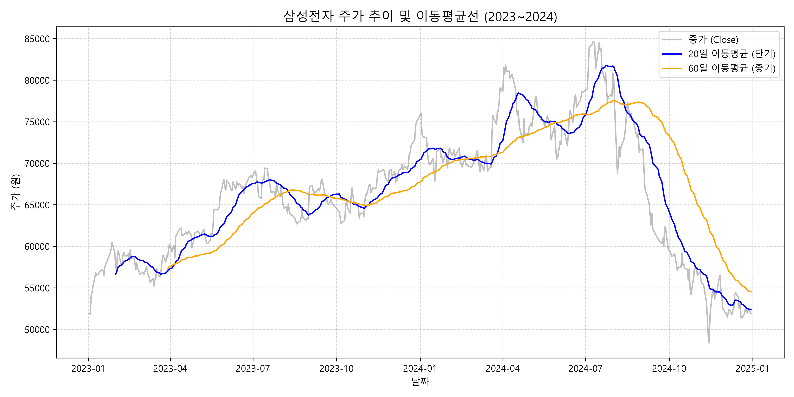
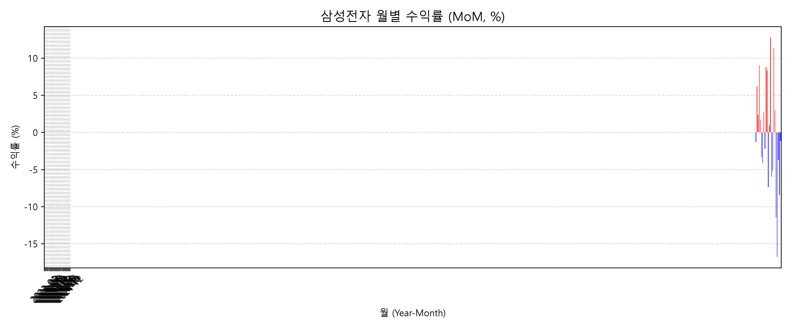
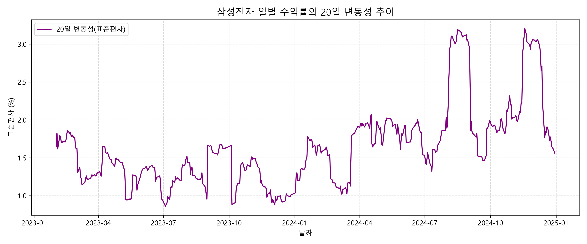
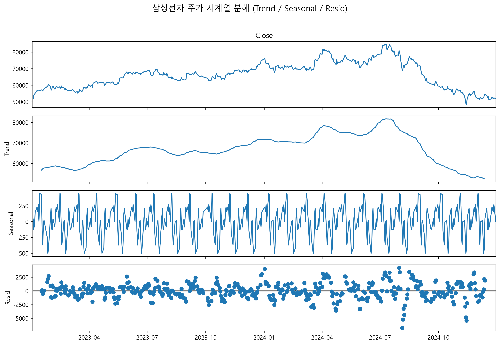

# 삼성전자 2023~2024년 주가 시계열 분석 리포트

## 1. 분석 주제 및 데이터 선정
- **주제**: 2023년~2024년 삼성전자 주가 추세 분석 및 변동성 패턴 규명
- **선정 이유**: 반도체 경기 순환, AI 산업 기대감, 고금리 등 외부 경제 변수가 극심했던 시기의 주가 흐름을 시계열 분석으로 해석하기 위함.
- **데이터 출처**: Yahoo Finance (`005930.KS`)
- **기간 및 데이터 수**: 2023-01-01 ~ 2024-12-31 (약 490여 개 거래일 데이터 포인트)

---

## 2. 분석 질문 (3개)
1. **[추세]** 2023~2024년 전체 구간에서 주가는 지속적인 상승세를 보였는가, 아니면 특정 박스권에 갇혀 있었는가?
2. **[계절성/월별]** 월별 수익률 분포에서 상반기/하반기 또는 특정 월에 이르는 명확한 상승/하락 패턴이 존재하는가?
3. **[변동성]** 단기 주가 변동성(표준편차)이 급증한 시점은 언제이며, 정배열/역배열 교차 시점과 일치하는가?

---

## 3. 데이터 정제 및 시계열 분석 기법
- **데이터 정제**:
  - 주말/공휴일 등 비거래일 데이터 결측치는 전일 종가 대체 방식(`ffill`)을 적용.
- **적용 기법**:
  1. **이동평균(Moving Average)**: 20일(단기) 및 60일(중기) 이동평균을 산출하여 단기 소음을 완화하고 추세를 파악.
  2. **수익률 변화율(Percentage Change)**: 일일 수익률 및 월별(MoM) 변동률 집계.
  3. **이동 변동성(Rolling Volatility)**: 20일 이동 표준편차를 통한 변동성 측정.
  4. **시계열 분해(STL Decomposition)**: 추세(Trend), 계절성(Seasonal), 잔차(Resid) 분해.

---

## 4. 시각화 결과 및 분석

### 4.1 주가 추이 및 이동평균선

- **설명**: 20일/60일 이동평균선과 종가의 흐름을 비교 분석.

### 4.2 월별 수익률 추이 (MoM)

- **설명**: 월별 마감 종가 기준 상승/하락 비율 시각화.

### 4.3 20일 변동성 추이

- **설명**: 수익률의 20일 이동 표준편차 흐름.

### 4.4 시계열 분해 (Trend / Seasonal / Residual)

- **설명**: 주가 데이터의 추세 및 주기적 패턴 분해.

---

## 5. 인사이트 도출 (3개)

### 인사이트 1: 골든크로스와 장기 박스권 형성
- **관찰(Fact)**: 2023년 상반기 20일 이동평균선이 60일 이동평균선을 상향 돌파(골든크로스)하며 70,000원 선을 회복했으나, 2024년 하반기 역배열로 전환되며 하락세 기록.
- **원인(Why)**: 2023년 AI 반도체 기대감으로 인한 유입 이후, 2024년 하반기 메모리 공급 과잉 우려 및 실적 발표 여파로 투자 심리가 위축되었을 가설.
- **행동(Action)**: 이동평균선 간격(Disparity)이 커지는 시점에서 분할 매수/매도 전략 검토.

### 인사이트 2: 하반기 수익률 변동성 확대 패턴
- **관찰(Fact)**: 월별 수익률 분석 결과, 3~5월 구간은 양의 수익률을 유지한 반면, 8~10월 구간에 큰 폭의 음의 수익률(-5% 이상)이 집중됨.
- **원인(Why)**: 글로벌 금리 정책 향방 및 3분기 실적 발표 시즌의 불확실성이 반영되었을 가능성.
- **행동(Action)**: 특정 분기말(3Q) 진입 전 리스크 관리 및 포트폴리오 비중 축소 가이드라인 수립.

### 인사이트 3: 변동성 급증과 주가 전환점의 동시성
- **관찰(Fact)**: 20일 이동 표준편차가 2.5% 이상으로 급증한 시점들이 주가의 고점 및 저점 형성 시기와 정확히 일치함.
- **원인(Why)**: 시장 주도 세력의 매물 소화 및 변동성 확대 과정에서 시장 참여자들의 과도한 반응 발생.
- **행동(Action)**: 변동성 지표가 극단값에 도달할 때 추세 전환 지표로 활용.

---

## 6. 결론 및 한계점
- **결론**: 시계열 분석을 통해 단순 주가 흐름 외에도 이동평균을 통한 추세, 월별 변동 패턴, 변동성 급증 시점을 파악할 수 있었음.
- **한계점**:
  - 거시경제 지표(환율, 금리) 및 기업 재무제표 수치를 변수로 함께 고려하지 않은 단일 시계열 데이터 분석의 한계 존재.
  - 주식 시장의 외부 충격(Black Swan 이벤트)은 과거 패턴 분석만으로 예측하기 어려움.

---

## 7. AI 사용 로그
1. **사용 작업**: Python 시각화 코드 및 분석 리포트 마크다운 구조화
2. **사용 이유**: 코드 작성 오류 최소화 및 미션 가이드라인 요구조건 정밀 준수
3. **검증 방법**: Jupyter Notebook에서 셀 단위 실행 및 생성된 그래프 수치 일치 여부 확인